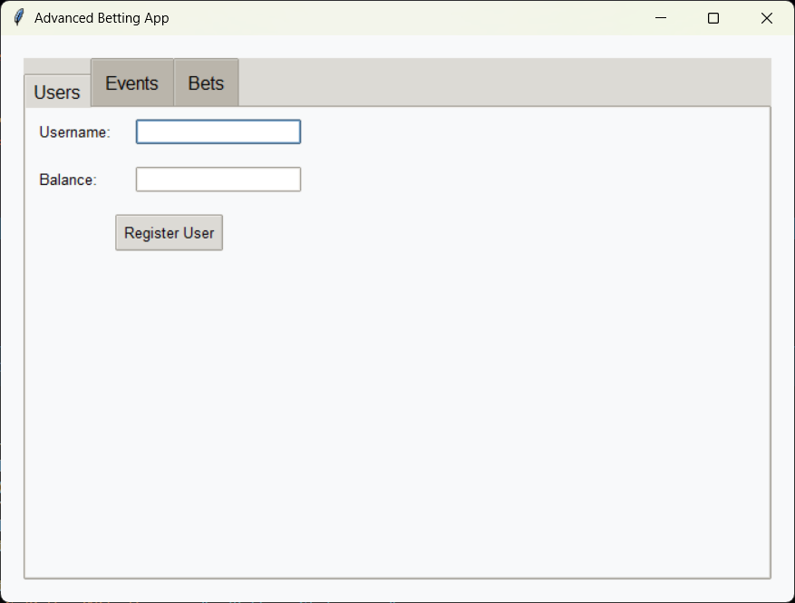
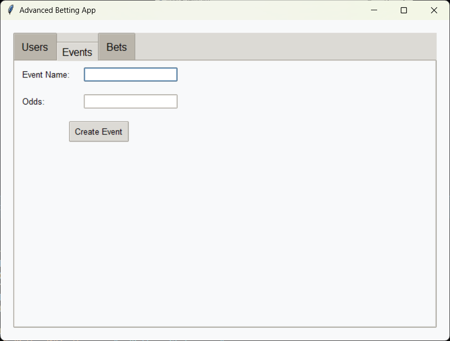
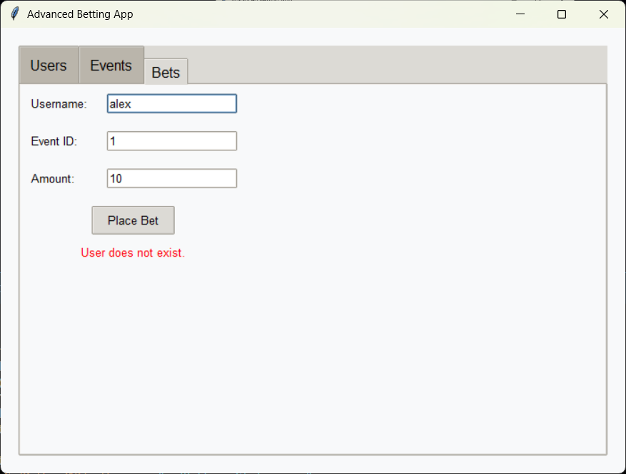

# Betting App with GUI  

A Python-based GUI betting application built with Tkinter that simulates a betting system. Users can register, place bets, create events, and view their balances in a sleek, macOS-like interface.  

---

## Features  

1. **User Registration**: Register new users with an initial balance.  
2. **Event Creation**: Create events with specified odds.  
3. **Place Bets**: Users can bet on events with specified amounts.  
4. **Event Result Management**: Admin can set the results of events.  
5. **Automatic Payout Calculation**: Users win or lose based on the event result.  
6. **Modern GUI**: A premium macOS-inspired theme for enhanced user experience.  

---
## FlowChart


---

## Algorithm  

### 1. **User Registration**  
   - Input username and balance.  
   - Check if the username already exists.  
   - If not, add the user to the database and set their balance.  

### 2. **Event Creation**  
   - Input event name and odds.  
   - Generate a unique event ID.  
   - Add the event to the database with no result initially.  

### 3. **Place Bet**  
   - Select the user and event.  
   - Input bet amount.  
   - Check if the user has sufficient balance.  
   - Deduct the amount from the user’s balance and store the bet details.  

### 4. **Set Event Result**  
   - Input event ID and result ("win" or "lose").  
   - Update the event result in the database.  

### 5. **Payout Calculation**  
   - For each bet:  
     - If the event result is "win", calculate the payout (`amount * odds`) and credit the user’s balance.  
     - If the result is "lose", the bet amount is lost.  

### 6. **View Balance**  
   - Display the user's current balance from the database.  

---

## Installation  

1. Clone the repository:  
   ```bash  
   git clone https://github.com/ShiboshreeRoy/Betting-App-with-GUI.git  
    
   ```  

2. Install required dependencies:  
   ```bash  
   pip install tkinter 
   ```  

3. Run the application:  
   ```bash  
   python betting_app.py  
   ```  

---

## Screenshots  







---

## Contributing  

1. Fork the repository.  
2. Create a feature branch (`git checkout -b feature-name`).  
3. Commit your changes (`git commit -m "Add feature name"`).  
4. Push to the branch (`git push origin feature-name`).  
5. Open a pull request.  

---

